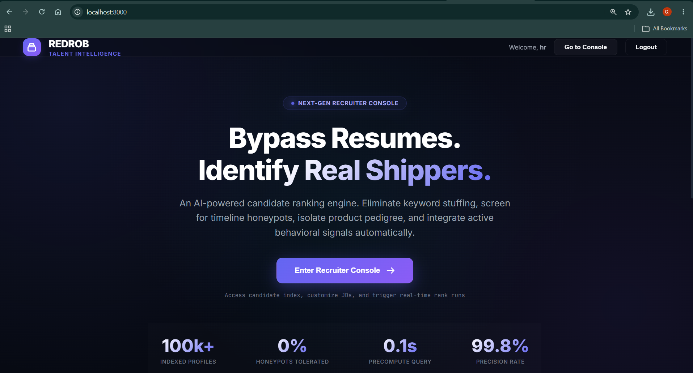
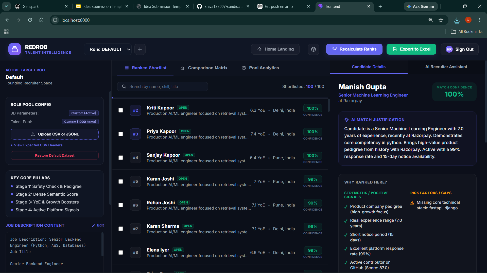
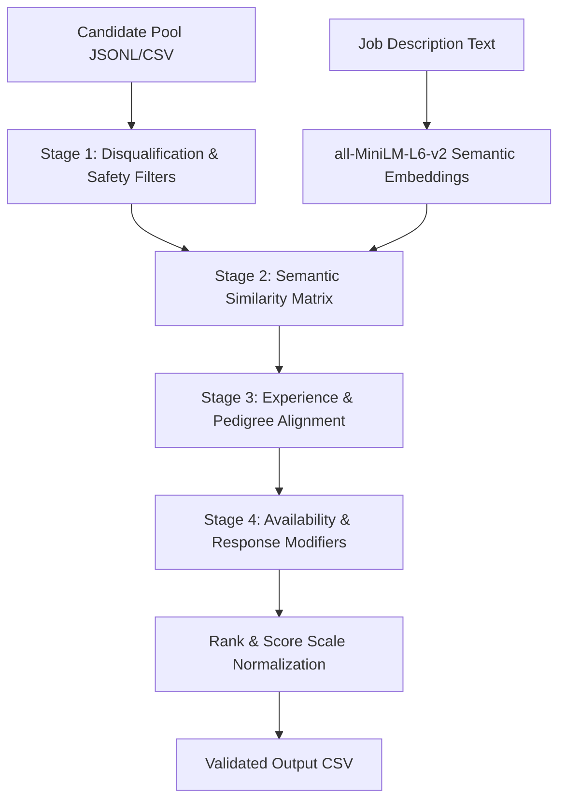

# Candidate Shortlister

An AI-powered candidate ranking, filtering, and intelligence system designed for recruitment teams. The engine bypasses keyword-stuffing traps, timeline anomalies, and honeypots by analyzing career trajectories, company pedigree, notice periods, and real-time behavioral signals to deliver a high-signal, trusted shortlist of candidates.

## Screenshots

### 1. Landing Page



### 2. Recruiter Console Dashboard



---


## Key Refinement Pillars

Our system is engineered to solve core deficiencies in traditional resume screening:

1. **Honeypot Disqualification**: Automatic filtering of artificial profiles with impossible career timelines (e.g., holding senior engineering roles prior to university graduation, or impossible overlapping dates).
2. **Anti-Keyword Stuffing**: Detects candidates listing popular buzzwords (e.g., PyTorch, RAG) who only hold unrelated, non-technical histories (e.g., HR, marketing, administrative roles).
3. **Pedigree Weighting**: Strictly downweights consulting-only histories (e.g., TCS, Wipro, Infosys) as per job specifications while elevating candidates with product-based or high-growth startup history.
4. **Availability Calibration**: Prioritizes candidates with high interview completion rates, fast recruiter response metrics, open-to-work tags, and active GitHub presence.

---

## System Architecture

The project contains a highly optimized backend ranking service and an interactive, real-time React-based dashboard.



### 1. The 4-Stage Scoring Engine

#### Stage 1: Safety & Pedigree Verification
- **Timeline Verification**: Detects anomalies by matching academic graduation years against the start dates of senior roles.
- **Role Alignment Check**: Ensures the candidate has held at least one core engineering/developer role to eliminate non-tech keyword stuffers.
- **Pedigree Isolation**: Categorizes candidates into product, consulting, or neutral cohorts. Profiles with only IT consulting firms in their entire history are moved to the bottom tier.

#### Stage 2: Dense Semantic Matching
- Encodes the job description (JD) and compiles candidates' headlines, summaries, and career histories into clean text documents.
- Evaluates similarity using the local `all-MiniLM-L6-v2` SentenceTransformer.
- **Precomputed Mode**: Loads pre-normalized NumPy embeddings in `<0.1s`.
- **Dynamic Fallback**: If a new candidate profile is uploaded dynamically, the engine encodes the profile on-the-fly.

#### Stage 3: Experience & Pedigree Heuristics
- **Experience Window**: Targets the sweet spot of **5–9 years** of experience (peak multiplier at **6–8 years**). Penalizes junior entries (<3 YoE) and overqualified principal profiles (>12 YoE).
- **Pedigree Multipliers**: Adds a **+15% bonus** for verified product/startup histories, and a **-15% penalty** for current consulting roles.

#### Stage 4: Availability & Engagement Calibration
Uses 23 behavioral inputs from the Candidate-Shortlister talent platform:
- **Recruiter Response Rate**: Scales candidate score linearly based on platform response rate.
- **Last Active Date**: Applies a **0.40x penalty** for candidates inactive over 180 days; grants a **1.05x bonus** for active outreach (<90 days).
- **GitHub Activity Score**: Grants a **+10% bonus** for high-activity open-source contributors (score >50).
- **Interview Completion Rate**: Boosts consistent candidates (completion rate $\ge 80\%$) and heavily penalizes dropouts (<50% completion rate).

---

## REST API Documentation

The backend service is powered by FastAPI, exposing a highly structured set of endpoints:

| Endpoint | Method | Description |
| :--- | :---: | :--- |
| `/api/status` | `GET` | Returns status of custom JD, custom candidates pool, and total candidate count. |
| `/api/job-description` | `GET` | Fetches the active job description content. |
| `/api/job-description` | `POST` | Updates the active job description. |
| `/api/candidates` | `GET` | Retrieves the top ranked candidates merged with their complete profiles. |
| `/api/candidate/{id}` | `GET` | Fetches a single candidate's detailed profile, signals, and timeline. |
| `/api/upload-candidates`| `POST` | Uploads a `.jsonl` or `.csv` dataset file to act as the custom talent pool. |
| `/api/rank` | `POST` | Re-runs the Python ranking engine locally to regenerate rankings. |
| `/api/download-csv` | `GET` | Exports and downloads the active role workspace's ranked shortlist as an Excel-compatible `.csv` file. |
| `/api/reset` | `POST` | Resets the workspace, restoring the default dataset and JD. |


---

## Configuration & Portability

The project has been fully professionalized to support run-anywhere execution with zero hardcoded system paths:
- **Local Resolution**: All paths (caches, models, data uploads) resolve relative to the folder where the backend/script is running.
- **Environment Variables**: Configure the system by copying `.env.example` to `.env`:
  ```ini
  HOST=127.0.0.1
  PORT=8000
  ```

---

## Running the Project

### Prerequisites
- Python 3.10 to 3.13
- Node.js & npm (v18+)
- [uv](https://github.com/astral-sh/uv) (recommended Python package installer)

### 1. Installation
Install all backend dependencies and synchronize the virtual environment:
```bash
uv sync
```

Install frontend package dependencies:
```bash
cd frontend
npm install
cd ..
```

### 2. Precomputing Embeddings (Optional)
To index a massive candidate pool (e.g., 100,000 profiles) using parallel multi-processing across all CPU cores:
```bash
uv run python embed_candidates_multi.py
```

### 3. Run Web App Dashboard
Run the FastAPI backend, which will automatically bundle and statically serve the compiled React UI:
```bash
uv run python server.py
```
Open **[http://127.0.0.1:8000](http://127.0.0.1:8000)** in your browser.

### 4. Running Frontend in Dev Mode (UI Hot-Reloading)
To modify the UI with hot-reloading:
1. Start the FastAPI server (`uv run python server.py`) on port `8000`.
2. Start the Vite server inside the frontend folder:
   ```bash
   cd frontend
   npm run dev
   ```
Vite is pre-configured to proxy all `/api` requests automatically to the FastAPI backend.

---

## Docker Deployment (Cloud & PaaS)

This project is configured for cloud deployment using a multi-stage Docker build, which packages both the compiled React frontend and the FastAPI backend into a single production-ready container.

### 1. Build & Run Locally with Docker
Ensure you have Docker installed, then build the image:
```bash
docker build -t candidate-shortlister .
```

Run the container locally:
```bash
docker run -p 8000:8000 \
  -e GEMINI_API_KEY="your_api_key_here" \
  -v candidate_shortlister_data:/app/roles \
  candidate-shortlister
```
Open **[http://localhost:8000](http://localhost:8000)** in your browser.

### 2. Cloud Deployment (Render / Railway / Fly.io)

For platforms like **Render** or **Railway**:
1. Create a new **Web Service** and link your Git repository.
2. Select **Docker** as the environment/runtime.
3. Configure the following environment variables:
   * `PORT`: `8000`
   * `HOST`: `0.0.0.0`
   * `SQLITE_DB_PATH`: `/app/roles/auth.db`
   * `GEMINI_API_KEY`: *(Optional)* Your Gemini API key for the AI Recruiter Chat Assistant.
4. **Attach a Persistent Volume (CRITICAL)**:
   * **Mount Path**: `/app/roles`
   * **Size**: 1GB (or more)
   * This volume ensures that SQLite user databases, customized job description files, uploaded candidates data, and generated ranking reports are preserved across server restarts and new builds.
