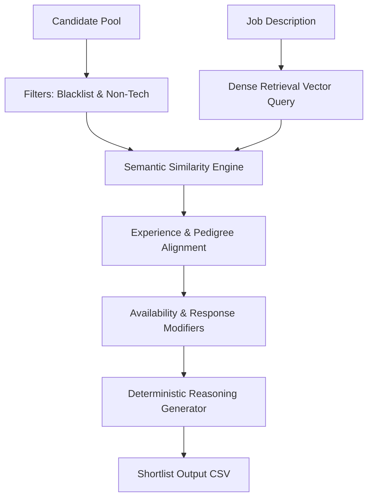

# Redrob Candidate Intelligence Platform

An AI-powered candidate ranking and intelligence system designed for recruiting teams. It bypasses keyword-stuffing traps and honeypots by understanding career trajectories, company pedigree, notice period bounds, and real-time behavioral signals to deliver a high-signal, trusted shortlist of candidates.

## System Architecture

Our solution is divided into a robust, offline-capable ranking engine and a highly interactive, modern web application dashboard.



### 1. The 4-Stage Hybrid Scoring Model
*   **Stage 1: Disqualification & Safety Filters**:
    *   **Timeline Anomalies (Honeypots)**: Profiles starting senior technical jobs years before their undergraduate graduation, or containing impossible overlapping dates, are identified and filtered to the bottom.
    *   **Keyword Stuffers (Non-Tech)**: Profiles that list hot keywords (like RAG, PyTorch) but have only held unrelated roles (like HR, Sales, or Marketing) with no technical career history are down-graded.
    *   **Consulting-Only Pedigree**: Candidates who have spent their entire career at IT consulting/service firms (TCS, Wipro, Infosys, etc.) are filtered out, as per the JD specifications, while retaining those with product company experience.
*   **Stage 2: Semantic Matching**:
    *   Matches candidate profiles against the job description using a local `all-MiniLM-L6-v2` SentenceTransformer model.
    *   **Precomputation Index**: Loads precomputed embeddings in `0.1s`.
    *   **Dynamic Fallback Encoding**: If a candidate isn't in the precomputed index, the engine dynamically encodes the text representation on-the-fly, ensuring compatibility with small custom test sets under 2 seconds.
*   **Stage 3: Experience & Pedigree Heuristics**:
    *   **Experience Alignment**: Targets 5–9 years of experience (peak multiplier at 6–8 years), penalizing junior developers (<3 YoE) and principal chasers (>12 YoE).
    *   **Pedigree Bonus**: Upweights candidates with career history at known product companies (startups or tech firms) and applies a slight penalty to current consulting roles.
*   **Stage 4: Behavioral Signal Integration**:
    *   Integrates 23 availability signals, including recruiter response rates, GitHub activity scores, last active dates, and interview completion rates, to prioritize responsive candidates.

---

## Shortlist Format compliance

The ranking engine outputs a validated, CSV file matching the format rules:
- **Zero Honeypots** in the top ranks.
- **Score Monotonicity**: Scores are strictly non-increasing by rank.
- **Alphabetical Tie-Breaker**: Candidates with identical scores are sorted by `candidate_id` in ascending order.
- **Fact-Based Reasonings**: Generates unique, non-templated match justifications indicating actual candidate strengths, locations, and notice period concerns.

---

## Web Application Dashboard

Built with a premium dark-themed design system using React, Vite, and FastAPI.

- **Interactive shortlists**: Displays the ranked candidates with interactive searching, filtering by skills, and score indicators.
- **Recalculator Controls**: Recalculates ranks in real-time by executing the backend ranking script.
- **Job Description Viewer**: Formats and displays the target JD guidelines.
- **Profile Deep Dive**: Displays a visual vertical career timeline, verified skills tag cloud, and a grid of behavioral signals (notice period, Git score, response rate).

---

## Running the Project

### Prerequisites
- Python 3.10 to 3.13
- Node.js & npm
- `uv` package manager

### 1. Project Initialization
Install all python dependencies and sync the virtual environment:
```bash
uv sync
```

### 2. Precomputing Embeddings (Optional)
To index the full 100,000 candidate pool using parallel multi-processing across all CPU cores:
```bash
uv run python embed_candidates_multi.py
```

### 3. Running the Ranker
To rank any candidate JSONL file and produce the submission CSV:
```bash
uv run python rank.py --candidates <path_to_jsonl> --out submission.csv
```

### 4. Running the Web Application
Start the backend FastAPI server (which serves the compiled React app statically at `http://127.0.0.1:8000/`):
```bash
uv run python server.py
```
